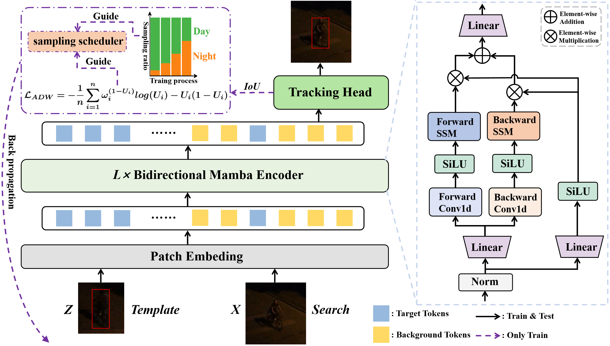

# MambaNUT
The official implementation for the **Arxiv 2024** paper [ [**MambaNUT: Nighttime UAV Tracking via Mamba-based Adaptive Curriculum Learning**](https://arxiv.org/pdf/2412.00626)]

[Models & Raw Results]( https://pan.baidu.com/s/1k7ns7x7fr5r_DXCI9xnVpA?pwd=tj3y) BaiduNetDisk

##  Methodology

<p align="center">
  
</p>


## Usage
### Installation
Create and activate a conda environment:
```
conda create -n MambaNUT python=3.10
conda activate MambaNUT
```

Install the required packages (Please refer to [Vim](https://github.com/hustvl/Vim) to install the Mamba environment):
```
pip install -r requirement.txt
```

## Data Preparation
Put the tracking datasets in ./data. It should look like:
   ```
   ${PROJECT_ROOT}
    -- data
         -- bdd100k_night
            |-- images
            |-- annotations
            ...
        -- ExDark
            |-- images
            |-- annotations
        -- shift_night
            |-- 0b3d-e686
            |-- 0b4d-d96f
            ...
        -- lasot
            |-- airplane
            |-- basketball
            |-- bear
            ...
        -- got10k
            |-- test
            |-- train
            |-- val
        -- coco
            |-- annotations
            |-- images
        -- trackingnet
            |-- TRAIN_0
            |-- TRAIN_1
            ...
            |-- TRAIN_11
            |-- TEST         
   ```

We provide download links for the nighttime training datasets used in our work: [BDD100K_Night](https://pan.baidu.com/s/1cmuWxLIR4HLUPpEfyMTgJw?pwd=13ku), [ExDark](https://pan.baidu.com/s/17K8OTUhAbt78LtX_VgyWMQ?pwd=7w6t), and [Shift_Night](https://pan.baidu.com/s/1U-znWCGNglMYyC1k3y-SmQ?pwd=4y7x ).

### Path Setting

Run the following command to set paths:
```
cd <PATH_of_MambaNUT>
python tracking/create_default_local_file.py --workspace_dir . --data_dir ./data --save_dir ./output
```
You can also modify paths by these two files:
```
./lib/train/admin/local.py  # paths for training
./lib/test/evaluation/local.py  # paths for testing
```

### Training
Download pre-trained [Mamba<sup>®</sup> weights](https://huggingface.co/Wangf3014/Mamba-Reg/resolve/main/mambar_small_patch16_224.pth) and put it under `$./pretrained_models/. 
```
# Training MambaNUT
python tracking/train.py --script mambanut --config mambar_small_patch16_224  --save_dir ./output -mode multiple --nproc_per_node 4

```


### Testing
Download the model weights from [BaiduNetDisk](https://pan.baidu.com/s/1k7ns7x7fr5r_DXCI9xnVpA?pwd=tj3y)

Put the downloaded weights on `<PATH_of_MambaNUT>/output/checkpoints/train/mambanut/mambar_small_patch16_224`

Change the corresponding values of `lib/test/evaluation/local.py` to the actual benchmark saving paths

 Testing examples:
- NAT2021 or other off-line evaluated benchmarks (modify `--dataset` correspondingly)
```
python tracking/test.py mambanut mambar_small_patch16_224 --dataset nat2021 --threads 16 --num_gpus 4
python tracking/analysis_results.py # need to modify tracker configs and names
```
- Test FLOPs, and Params.
```
# Profiling MambNUT
python tracking/profile_model.py --script mambanut --config mambar_small_patch16_224
```


## Acknowledgment
* This repo is based on [OSTrack](https://github.com/botaoye/OSTrack) and [PyTracking](https://github.com/visionml/pytracking) library which are excellent works and help us to quickly implement our ideas.


## Citation
If our work is useful for your research, please consider citing:
```Bibtex
@article{wu2024mambanut,
  title={MambaNUT: Nighttime UAV Tracking via Mamba-based Adaptive Curriculum Learning},
  author={Wu, You and Yang, Xiangyang and Wang, Xucheng and Ye, Hengzhou and Zeng, Dan and Li, Shuiwang},
  journal={arXiv preprint arXiv:2412.00626},
  year={2024}
}
```

